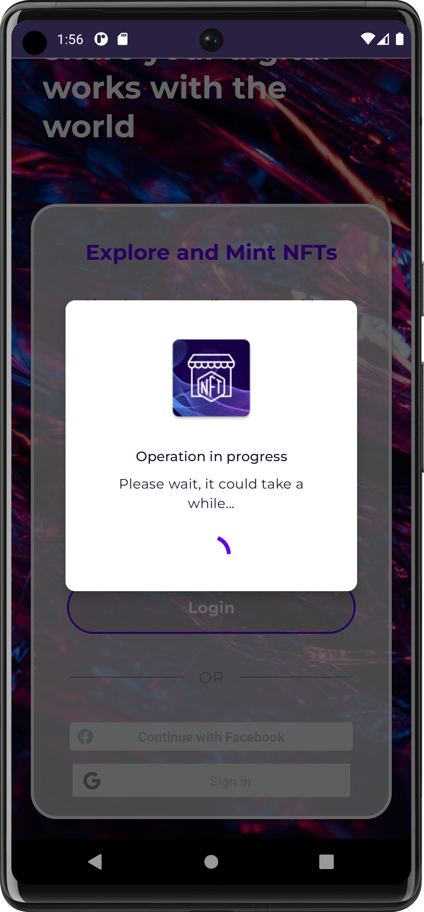
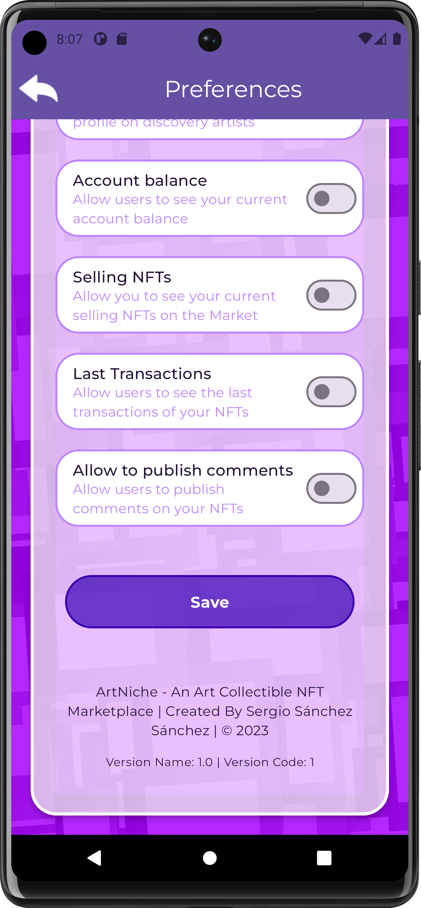
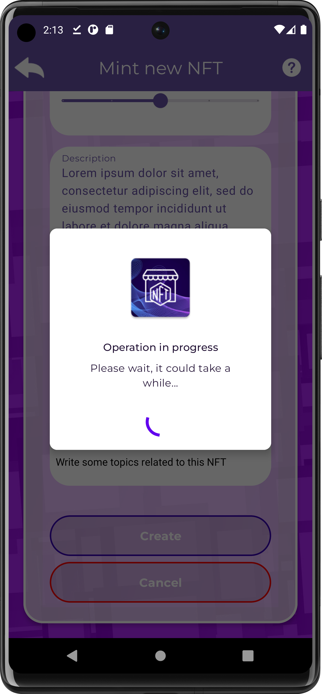

# ArtNiche - An art collectible NFT marketplace for digital artists

  

Explore exclusive art collectibles by the most in-demand creators, trade with other collectors in the Marketplace, and mint your own NFTs all in one place!

 
 
 
 
 

 ## Tech stack & Open-source libraries
 - Minimum SDK level 23
 - 100% [Kotlin](https://kotlinlang.org/)
 - Using [Android Architecture Starter Templates](https://github.com/android/architecture-templates).
 - Android Studio Flamingo.
 - Architecture
   - MVI, Immutability and UDF (Unidirectional Data Flow).
   - Clean architecture approach.
   - [Dagger Hilt](https://developer.android.com/training/dependency-injection/hilt-android) - dependency injection
 - UI Layer
   - LiveData - notify domain layer data to views.
   - Lifecycle - dispose observing data when lifecycle state changes.
   - ViewModel - UI related data holder, lifecycle aware.
   - [Coil](https://coil-kt.github.io/coil/) - An image loading library for Android backed by Kotlin Coroutines.
   - [Jetpack Camera X](https://developer.android.com/jetpack/androidx/releases/camera) - CameraX is a Jetpack support library, built to help you make camera app development easier.
   - Palette API - The Palette library provides a powerful and intuitive API for creating more engaging apps extracting prominent colors from images.
   - [Jetpack Compose](https://developer.android.com/jetpack/compose) - Jetpack Compose is a modern toolkit for building native Android UI. Jetpack Compose simplifies and accelerates UI development on Android with less code, powerful tools, and intuitive Kotlin APIs. 
   - [Jetpack Compose Material 3](https://developer.android.com/jetpack/androidx/releases/compose-material3) - Build Jetpack Compose UIs with components from Material Design 3, the next evolution of Material Design. Material 3 includes updated themes and components, and Material You customization features such as dynamic color.
   - [Accompanist FlowLayout](https://github.com/google/accompanist) - A collection of extension libraries for Jetpack Compose from Google.
   - [Vico](https://github.com/patrykandpatrick/vico) - Vico is a light and extensible chart library for Android. It’s compatible with both Jetpack Compose and the view system, but its two main modules—compose and views—are independent.
   - [SplashScreen API](https://developer.android.com/develop/ui/views/launch/splash-screen) - Starting in Android 12, the SplashScreen API lets apps launch with animation, including an into-app motion at launch, a splash screen showing your app icon, and a transition to your app itself. A SplashScreen is a Window and therefore covers an Activity.
  - Data Layer
    - [Retrofit2 + Moshi](https://github.com/square/retrofit) - constructing the REST API
    - [OkHttp3](https://github.com/square/okhttp) - implementing interceptor, logging and mocking web server
    - [Room](https://developer.android.com/jetpack/androidx/releases/room?hl=es-419) - The Room persistence library provides an abstraction layer over SQLite to allow for more robust database access while harnessing the full power of SQLite.
    - Cloud Firestore - To persist data related to market and users.
    - Firebase Auth (Social Media integrations) - To authenticate users.
    - Firebase Storage - To save files such us wallets and user profile images.
    - [Web3J](https://docs.web3j.io/4.9.8/) - Web3j is a highly modular, reactive, type safe Java and Android library for working with Smart Contracts and integrating with clients (nodes) on the Ethereum network
    - [Cache4k](https://github.com/ReactiveCircus/cache4k) cache4k provides a simple in-memory key-value cache, with support for time-based (expiration) and size-based evictions.
    - [Jetpack Datastore](https://developer.android.com/topic/libraries/architecture/datastore) - Jetpack DataStore is a data storage solution that allows you to store key-value pairs or typed objects with protocol buffers.
    
    
    
 ## Onboarding & Account management
 
 
 
 
 
 
 
 ## User Profile
 
 
 
 
 
 
 
 
 
  ## Mint Art Collectible NFT
  
  
  
  
  
  
  
  
  
  ## NFT Detail
  
  
  
  
 
   ### NFT
   
  
  
  
  
  # Artist Detail
  
  
  
  
  
  
  
  
  
 # Art Collectibles Categories
 
 
 
 
 
 ## Please Share & Star the repository to keep me motivated.
  
  
 
 ## Attributions
 
 
<a href="https://www.freepik.com/free-photo/handsome-cheerful-young-man-with-stylish-haircut-dimpled-smile-posing-isolated-against-blank-yellow-wall-dressed-cozy-maroon-sweater-having-confident-look_11891916.htm#page=2&query=person&position=3&from_view=search&track=robertav1_2_sidr">Image by karlyukav</a> on Freepik

 
<a href="https://www.freepik.com/free-photo/handsome-cheerful-man-teenager-keeps-arms-folded-looks-pensively-aside-has-gentle-smile-wears-basic-jumper-poses_13844944.htm#page=4&query=person&position=39&from_view=search&track=robertav1_2_sidr">Image by wayhomestudio</a> on Freepik

 
<a href="https://www.freepik.com/free-photo/no-problem-concept-bearded-man-makes-okay-gesture-has-everything-control-all-fine-gesture-wears-spectacles-jumper-poses-against-pink-wall-says-i-got-this-guarantees-something_13580471.htm#query=person&position=24&from_view=search&track=robertav1_2_sidr">Image by wayhomestudio</a> on Freepik

 
Image by <a href="https://www.freepik.com/free-photo/portrait-beautiful-blond-woman-with-trendy-hairstyle_27506439.htm#page=9&query=person&position=19&from_view=search&track=sph">Freepik</a>

 
    
